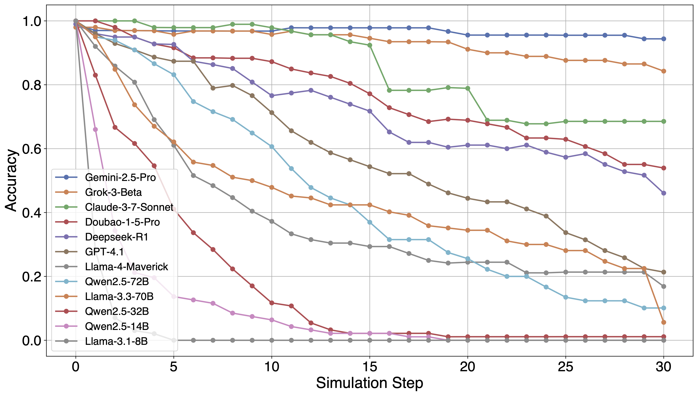

# Turing Machine Bench (TMBench)


## Table of Contents
- [Introduction](#introduction)
- [Repo Architecture](#repo-architecture)
- [Environment Setup](#environment-setup)
- [Data Generation](#data-generation)
- [LLM Simulation and Evaluation](#run)
- [Acknowledgement](#acknowledgement)

## Introduction
This is the official repository for [Computational Reasoning of Large Language Models](https://arxiv.org/pdf/2504.20771?). This repository includes the scripts and instructions for generating data, running LLM simulations, and evaluating model performance. We also release at [huggingface](https://huggingface.co/datasets/Haitao999/Turing-Machine-Bench).
<p align="center">

</p>

## Repo Architecture
```
TMBench                         # Root directory
├── README.md
├── assets                      # Plot Figures
│   └── TMBench.pdf
├── data
│   ├── TMBench.json            # Base variant
│   ├── TMBenchGreek.json       # Greek-letter variant
│   ├── TMBenchNumber.json      # Number variant
│   └── TMBenchSpecial.json     # Special-character variant
├── requirements.txt            # Python dependencies
├── results                     # Saved results
├── scripts
│   └── RUNME.sh                # Bash script for data generation, LLM simulation and evaluation
└── src
    ├── acc.py                  # Accuracy computation and evaluation metrics
    ├── established_bench       # Evaluation of established bench
    │   ├── aime2024.py
    │   ├── gpqa_diamond.py
    │   ├── math500.py
    │   └── print_result.py
    ├── predict.py              # Inference for running LLM simulation
    ├── predict_close_ai.py     # Inference for running LLM API
    ├── prompt.py               # Prompt construction for model input
    └── tag_generate.py         # Generates data with the m-Tag system
```
## Environment Setup
- Python 3.10.16
- Cuda 12.4
- PyTorch 2.6.0
- Required libraries are listed in `requirements.txt`.

```
pip install -r requirements.txt
```

## Data Generation
To generate the data required for Turing Machine evaluation, run the following command:
```
python tag_generate.py --output_path OUTPUT_PATH
```

## LLM Simulation and Evaluation
```
python src/predict.py --model $model --bench_name TMBench --chat
```
- `--model`: The model to use for prediction (e.g., `Qwen/Qwen2.5-14B-Instruct`).
- `--bench_name`: The name of the benchmark (e.g., `TMBench`).
- `--chat`: Option to use chat-based interaction.

For close-source model:
```
python src/predict_close_ai.py --model gemini-2.5-pro-exp-03-25 --bench_name TMBench --api google
```

Evaluate the model's performance with the following command:
```
python src/acc.py --model $model --bench_name TMBench --chat
```
## Acknowledgement
We acknowledge the contributions of the following state-of-the-art language models and well-established benchmarks that supported our study:

Models: [Gemini](https://deepmind.google/technologies/gemini/), [Gemma](https://ai.google.dev/gemma), [DeepSeek](https://www.deepseek.com/), [Qwen](https://huggingface.co/Qwen), [LLaMA](https://www.llama.com/), [Grok](https://x.ai/), [Claude](https://www.anthropic.com/index/claude), [GPT](https://openai.com/), and [Doubao](https://www.doubao.com/)

Datasets: [AIME](https://artofproblemsolving.com/wiki/index.php/AIME_Problems_and_Solutions), [MATH500](https://github.com/openai/prm800k), [GPQA](https://github.com/idavidrein/gpqa) and [MMLU-Pro](https://github.com/TIGER-AI-Lab/MMLU-Pro)